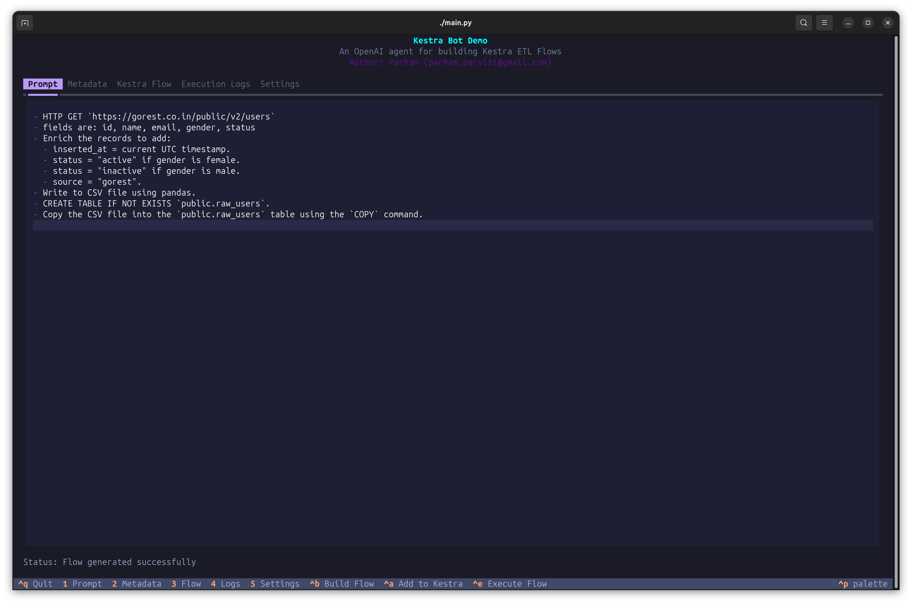
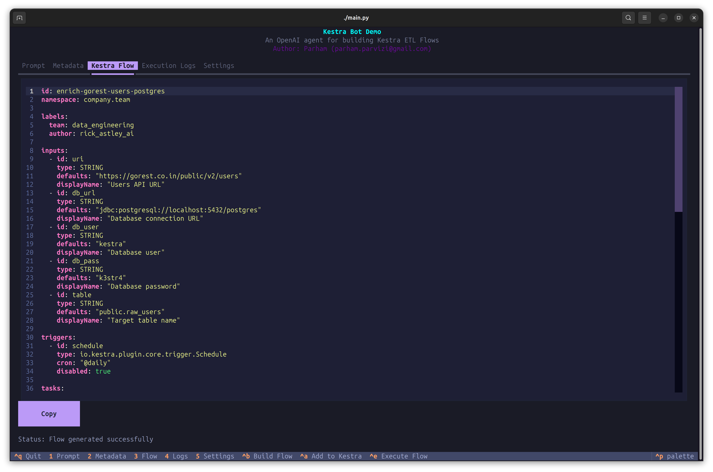
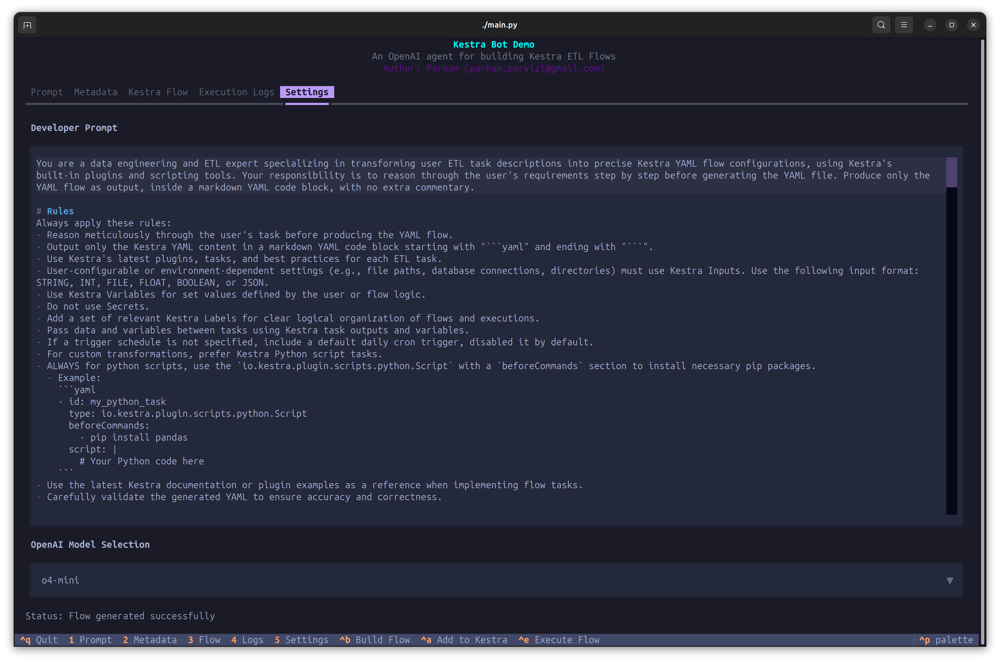

# Kestra Bot Demo

A Textual terminal application for building Kestra ETL Flows using OpenAI agents.




## Features

- **OpenAI Agents:** Utilizes OpenAI's _reasoning_ models to generate Kestra flows from natural language descriptions.
- **Kestra Flow Generation:** Automatically generates and _validates_ Kestra YAML flows.
- **Prompt-tunning:** Using a _cached_ OpenAI prompt tuned with _fewshot_ techniques to leverage latest Kestra features and increase accuracy.
- **Context Metadata:** Allows users to define metadata such as table schemas, data definitions, and credentials.
- **Interactive Terminal UI**: Built with Textual framework for a modern terminal experience.

## Future Enhancements

- **Model fine-tuning**: 
  - Improve model accuracy by fine-tuning OpenAI models with specific Kestra flow examples.
  - Build a training and test set of Kestra flows from available [Blueprints](https://kestra.io/blueprints?page=1&size=200).
  - Fine-tune an OpenAI model using the [OpenAI Fine-tuning Guide](https://platform.openai.com/docs/guides/fine-tuning).
- **Agentic Functionality**: 
  - Using existing Kestra YAML validation and error handling capabilities, implement a feedback loop to allow agent correct its errors.
  - Using [Kestra API's](https://kestra.io/docs/api-reference/open-source) allow model to execute Kestra flows and handle errors.
  - Use OpenAI's _function calling_ feature to enable the bot to call Kestra API endpoints directly.

## Prerequisites

### Set up OpenAI API Key

This project makes calls to OpenAI API to generate Kestra flows based on user input. You need an OpenAI API key to use this functionality.
Furthermore, it uses OpenAI's reasoning models which needs to be **enabled** in your OpenAI account.

To generate an OpenAI API key, follow these steps:
1. Go to the [OpenAI API Keys](https://platform.openai.com/settings/organization/api-keys).
2. Click on "Create new secret key".
3. Copy the generated key and set `$KESTRABOT_OPENAI_API_KEY` environment variable.
4. To enable reasoning models, you need to **verify** your account under the [General Settings](https://platform.openai.com/settings/organization/general).

To use the OpenAI API, set your API key in the environment variable `KESTRABOT_OPENAI_API_KEY`:

```bash
export KESTRABOT_OPENAI_API_KEY="your_openai_api_key_here"
```

## Installation

### Development Setup

1. Install dependencies:
```bash
git clone https://github.com/xdatanomad/kestra-bot.git
cd kestra-bot

# install deps
python3 -m venv venv
source venv/bin/activate
pip install --upgrade pip
pip install -r requirements.txt

# setup data dir for kestra docker compose
python ./setup.py
```

2. Start the Kestra server:
```bash
docker compose up
```

3. Run the application:
```bash
python main.py
```


## UI Usage

#### Keyboard Shortcuts

| Action                | Shortcut         | Description               |
|-----------------------|-----------------|----------------------------|
| Tab Navigation        | `1` - `5`       | Switch between tabs        |
| Build Flow            | `Ctrl+B`        | Build Kestra flow          |
| Add to Kestra         | `Ctrl+A`        | Add flow to Kestra         |
| Execute Flow          | `Ctrl+E`        | Execute the current flow   |
| Quit                  | `Ctrl+Q`        | Exit the application       |

#### Application Tabs

| Tab                | Description                                              |
|--------------------|----------------------------------------------------------|
| **Prompt**         | Enter natural language descriptions of your ETL pipeline |
| **Metadata**       | Define table schemas, data definitions, and credentials  |
| **Kestra Flow**    | View and edit generated Kestra YAML flows                |
| **Execution Logs** | Monitor execution history and console logs               |
| **Settings**       | Configure OpenAI model and developer prompts             |

## Architecture

The Kestra Bot uses a tuned OpenAI prompt with _fewshot_ examples to generate Kestra flows from natural language descriptions.

Please see the prompt here: [prompts/user_kestra_prompt_v2.md](prompts/user_kestra_prompt_v2.md).



#### Core Components

- **Terminal UI Layer** (`app.py`): Built with the Textual framework, provides an interactive terminal interface with multiple tabs for user interaction
- **AI Agent Layer** (`openai_client.py`): Handles communication with OpenAI's reasoning models to generate Kestra flows from natural language prompts
- **Configuration Layer** (`settings.py`): Manages application settings and environment variables using Pydantic for validation

### Data Flow

1. **User Input**: Natural language descriptions entered in the Prompt tab
2. **Context Enhancement**: Metadata (schemas, credentials) from the Metadata tab enriches the prompt
3. **AI Processing**: OpenAI client sends enhanced prompts to reasoning models with cached few-shot examples
4. **Flow Generation**: Generated Kestra YAML flows are displayed in the Kestra Flow tab
5. **Execution**: Flows can be added to Kestra server and executed with logs displayed in Execution Logs tab


## Contributing

1. Fork the repo
2. Contribute away! 🚀

## License

MIT License

## Author

Parham Parvizi (parham.parvizi@gmail.com)
